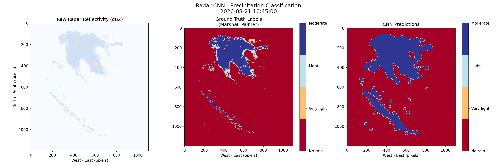
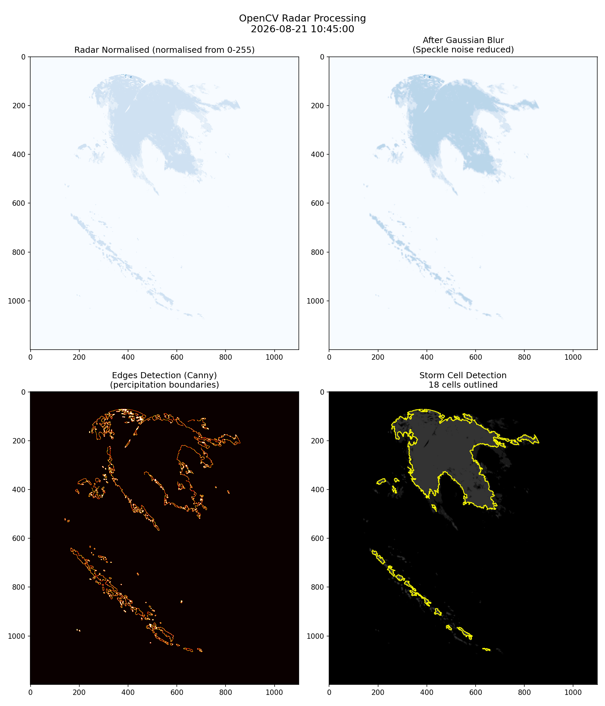

# DWD Radar Precipitation Classification

A weather radar processing and classification pipeline using real operational data from the German Weather Service (DWD). Combines OpenCV image processing, physics-based Marshall-Palmer conversion, and a CNN classifier to detect and classify precipitation intensity across Germany.

## Pipeline Overview

```
DWD Radar Data (HG composite, 1km resolution)
        ↓
OpenCV Processing
  - Gaussian blur (speckle noise reduction)
  - Canny edge detection (precipitation boundaries)
  - Morphological operations (edge cleaning)
  - Contour detection (storm cell identification)
        ↓
Marshall-Palmer Z-R Conversion
  - dBZ reflectivity → rainfall rate (mm/hr)
  - Z = 200 * R^1.6
        ↓
CNN Classification
  - 4 precipitation classes
  - Weighted loss for class imbalance
  - WeightedRandomSampler for balanced training
        ↓
93.4% overall accuracy
```

## Results



*Left: Raw radar reflectivity. Middle: Ground truth labels from Marshall-Palmer. Right: CNN predictions.*



*OpenCV pipeline: normalised radar, Gaussian blur, Canny edge detection, storm cell contours.*

| Class | Precision | Recall | F1 |
|---|---|---|---|
| No rain | 1.000 | 0.939 | 0.969 |
| Very light | 0.071 | 0.789 | 0.130 |
| Light | 0.573 | 0.891 | 0.698 |
| Moderate+Heavy | 0.978 | 0.901 | 0.938 |

**Overall accuracy: 93.4%**

## Data

DWD open radar data - HG national composite:
```
https://opendata.dwd.de/weather/radar/composit/hg/
```

Real operational radar updated every 5 minutes. Coverage: nationwide Germany at 1km resolution.

## Key Technical Decisions

- **Canny edge detection** with threshold1=30, threshold2=100 for precipitation boundary detection
- **Marshall-Palmer Z-R relationship** for rainfall rates
- **Class imbalance handling**: 89% no-rain pixels handled with weighted CrossEntropyLoss and WeightedRandomSampler
- **Heavy rain merged into moderate**: only 2 patches available - insufficient for separate class
- **16x16 patches with stride 8**: overlapping windows for dense spatial coverage

## Requirements

```bash
pip install opencv-python wradlib numpy matplotlib torch torchvision jupyter
```

## Usage

```bash
git clone https://github.com/margaretjohn14-alt/dwd-radar-classification
cd dwd-radar-classification
jupyter notebook
```

Open `radar_precipitation_classification.ipynb` and run the file.

Data downloads automatically from DWD open data server.
